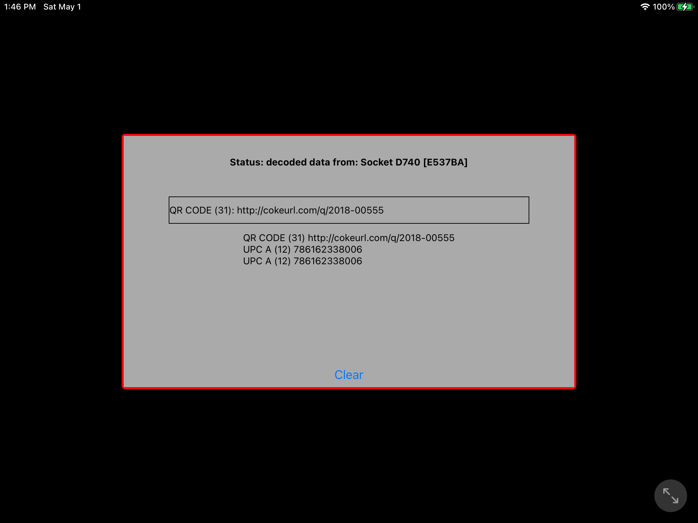
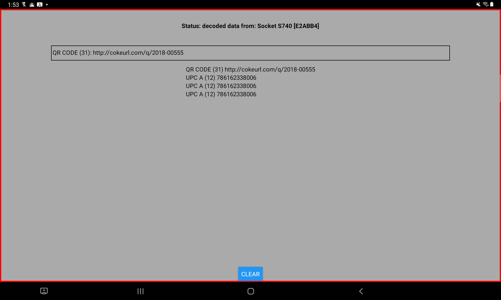
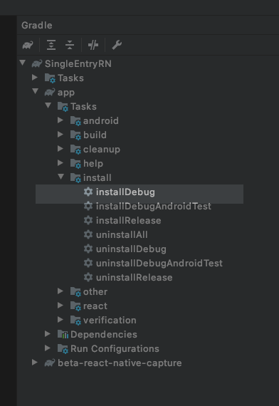

# SingleEntryRN

SingleEntryRN is a very simple React Native app using the Socket Mobile React Native Capture Module.

It shows how to use the Socket Mobile CaptureJS SDK to receive the decoded data from the Socket Mobile devices into an input box.

The connection state of the Socket Mobile device is shown in a status field at the top of the app.

## Screenshots

On iOS iPad in landscape orientation:


On Android Tablet in landscape orientation:


## Install

In a terminal window type the following commands:

```sh
git clone git@github.com:socketmobile/singleentry-rn.git`

cd singleentry-rn
```

Using npm:

```sh
npm install
```

Using yarn:

```sh
yarn install
```

then make sure the **iOS** portion of the application is setup correctly by typing the following in the terminal window.

```sh
cd ios
pod install
```

On Android when the Android project is loaded in the Android Studio, the gradle task `InstallDebug` or `InstallRelease` as shown in this picture:


### Android

When running SingleEntryRN for Android, the Socket Mobile Companion must be installed on the device.

Socket Mobile Companion can be found [here](https://play.google.com/store/apps/details?id=com.socketmobile.companion&hl=en_US&gl=US "Google Play Store").

Use the Socket Mobile Companion to connect a Socket Mobile barcode scanner. This is a one time setup operation that does not need to get repeated unless you connect the scanner to a different host or the bonding of the scanner has been cleared.

The Socket Mobile Companion must stay installed on the device as it host the service used for connecting to the scanner.

The React Native Capture module checks if the service is running, and if not it will start it in the background. If the Socket Mobile Companion is not installed on the device an error `SktErrors.ESKT_UNABLEOPENDEVICE` (-27) will be returned from the initial `capture.open` call.
The SingleEntryRN status will display a text asking if the Socket Mobile Companion is installed on the device.

### iOS

The easiest way to connect a Socket Mobile device is by using the Socket Mobile Companion app that can be downloaded from the App Store [here](https://apps.apple.com/us/app/socket-mobile-companion/id1175638950 "Apple App Store").

## React Native Capture Module

The Socket Mobile React Native Capture Module uses the CaptureJS SDK. That is the only dependency (other than React Native itself) this module has.

This allows to use the same CaptureJS SDK for a browser webapp, than a React Native app.

The only difference in the case of a React Native App vs a Webapp using the CaptureJS SDK is the Capture Object.

For a React Native app, Capture is instantiated by doing a `new` on `CaptureRn()` instead of simply `Capture()`.

Here is an example:

```javascript
    const capture = new CaptureRn();
    const appInfo = {
      appId: 'web:com.socketmobile.SingleEntryRN',
      developerId: 'bb57d8e1-f911-47ba-b510-693be162686a',
      appKey:
        'MC4CFQCcoE4i6nBXLRLKVkx8jwbEnzToWAIVAJdfJOE3U+5rUcrRGDLuXWpz0qgu',
    };
    capture
      .open(appInfo, onCaptureEvent)
      .then(() => {
        setStatus('capture open success');
      })
      .catch(err => {
        myLogger.error(err);
        setStatus(`failed to open Capture: ${err}`);
        // this is mostly for Android platform which requires
        // Socket Mobile Companion app to be installed
        if (err === SktErrors.ESKT_UNABLEOPENDEVICE) {
          setStatus('Is Socket Mobile Companion app installed?');
        }
      });

```

The same applies when a Socket Mobile device connects to the host as shown here:

```javascript
        ../..
        case CaptureEventIds.DeviceArrival:
          const newDevice = new CaptureRn();
          const {guid, name} = e.value;
          newDevice
            .openDevice(guid, capture)
            .then(result => {
              myLogger.log('opening a device returns: ', result);
              setStatus(`result of opening ${e.value.name} : ${result}`);
              setDevices(prevDevices => {
                prevDevices = prevDevices || [];
                prevDevices.push({
                  guid,
                  name,
                  handle: newDevice.clientOrDeviceHandle,
                  device: newDevice,
                });
                return [...prevDevices];
              });
            })
            .catch(err => {
              myLogger.log(err);
              setStatus(`error opening a device: ${err}`);
            });
          break;
        ../..
```

That is the only difference with CaptureJS, the rest of the API is exactly the same.

The CaptureJS SDK documentation can be found here: [Socket online documentation](https://docs.socketmobile.com/capturejs/en/latest/ "docs.socketmobile.com")

## Application Registration and Credentials

The Socket Mobile Capture SDK requires the application to be registered on the Socket Mobile Developer Profile which requires a developer registration that will give a developer ID in a form of a UUID.

The application can then be registered using the `web` prefix separated by a `:` (colon) followed by the application ID, i.e.: `com.socketmobile.SingleEntryRN` and by using your Socket Mobile Developer ID returned during your developer registration.

  NOTE: the application ID is case sensitive.

An **AppKey** is generated in return of the application registration.

The Socket Mobile Developer portal can be found here: [Socket Mobile Developer Portal](https://www.socketmobile.com/developers "socketmobile.com/developers").

The Developer ID, the AppID and the AppKey are the 3 arguments required to open Capture.

## Receiving the Capture notifications including the decoded data

When opening Capture a callback is required as argument. This is this callback that will be called by Capture each time a notification is received including the device presence (DeviceArrival and DeviceRemoval) and of course each time a Socket Mobile device has decoded some data (DecodedData).

Here is an example for handling the decoded data:

```javascript

      const onCaptureEvent = (e, handle) => {
        ../..

        case CaptureEventIds.DecodedData:
          const deviceSource = devices.find(d => d.handle === handle);
          if (deviceSource) {
            setStatus(`decoded data from: ${deviceSource.name}`);
          }
          if (lastDecodedData.length) {
            setDecodedDataList(prevList => {
              const newDecodedData = {...lastDecodedData};
              newDecodedData.id = dataId++;
              return [newDecodedData, ...prevList];
            });
          }
          lastDecodedData = {
            data: arrayToString(e.value.data),
            length: e.value.data.length,
            name: e.value.name,
          };
          setDecodedData(lastDecodedData);
          break;
      }

```

  NOTE: The second argument of the `onCaptureEvent` callback is a handle to identify the source of the Capture event.

## Debugging on a real target device

First make sure the React Native Capture NPM package is present in `package.json` and in the `node_modules`.

You may have to delete the `node_modules` directory and perform an install again using:

```sh
npm install
```

or:

```sh
yarn install
```

Then make sure **Metro** is running before launching the app especially if you want to run the application in debug.
For that, go to the project root and run metro:
`cd  singleentry-rn`
`react-native start` if you have **react-native** installed globally or `npx react-native start` otherwise.

### Android Debugging

In an Android environment in order to have the Android device being able to reach the Metro bundler, you need to reverse proxy the port 8081 and this can be achieved by typing the following command in a terminal window:
`adb reverse tcp:8081 tcp:8081`

Usually this command prints out `8081` when it succeeds.

### iOS Debugging

In iOS the Pod file needs to be installed. This should come after making sure that the React Native Capture NPM package is present in the `node_modules` folder of SingleEntryRN.

If that the case you may have to delete the `Pods` folder under the `ios` subdirector and re-run a `pod install` within the `ios` subdirectory.

This should re-install the React Native Capture cocoapods.
